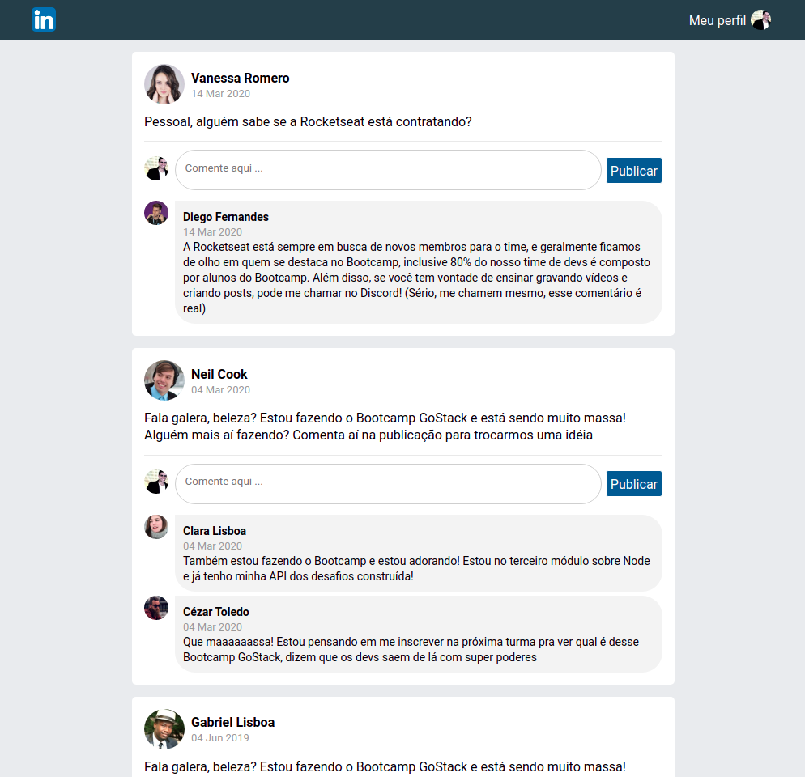

<h2 align="center">Interface Semelhando ao LinkedIn, em ReactJS</h2>

  

  

  

  

  

  <a href="#bookmark_tabs-tecnologias">Tecnologias</a>&nbsp;&nbsp;&nbsp;|&nbsp;&nbsp;&nbsp;
  <a href="#-projeto">Projeto</a>&nbsp;&nbsp;&nbsp;|&nbsp;&nbsp;&nbsp;
  <a href="#-como-contribuir">Como contribuir</a>&nbsp;&nbsp;&nbsp;|&nbsp;&nbsp;&nbsp;
  <a href="#memo-licença">Licença</a>

<h1 align="center">

</h1>

## :bookmark_tabs: Tecnologias

Technologies used in the development of the project:

- [ReactJS](https://reactjs.org/)
- [Babel](https://babeljs.io/)
- [Webpack](https://webpack.js.org/)
- [Webpack Dev Server](https://webpack.js.org/configuration/dev-server/)

## 💻 Projeto

Aaplicação do zero utilizando Webpack, Babel, Webpack Dev Server e ReactJS.

Nessa aplicação foir desenvolvido uma interface semelhante com a do LinkedIn, utilizando React.

As informações contidas na interface são estáticas, manipuladas no estado do componente Pai e passadas por meio de propriedades para os demais componentes filhos.

## 🤔 Como contribuir

- Faça um fork desse repositório;
- Cria uma branch com a sua feature: `git checkout -b minha-feature`;
- Faça commit das suas alterações: `git commit -m 'feat: Minha nova feature'`;
- Faça push para a sua branch: `git push origin minha-feature`.

Depois que o merge da sua pull request for feito, você pode deletar a sua branch.

## :memo: Licença

Esse projeto está sob a licença MIT. Veja o arquivo [LICENSE](LICENSE.md) para mais detalhes.
